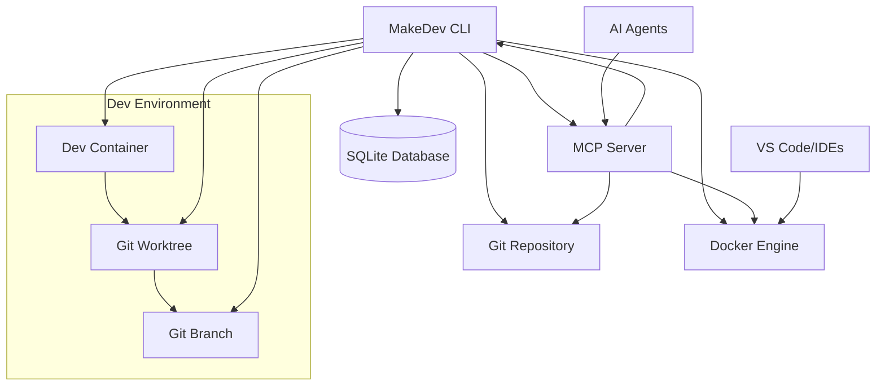
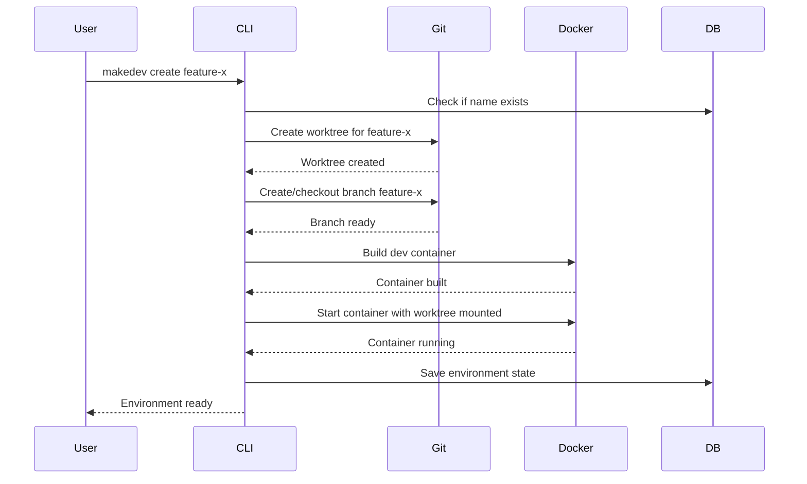
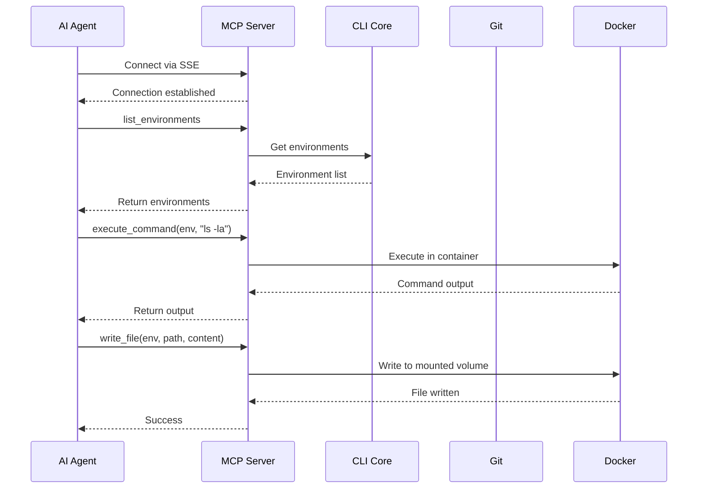
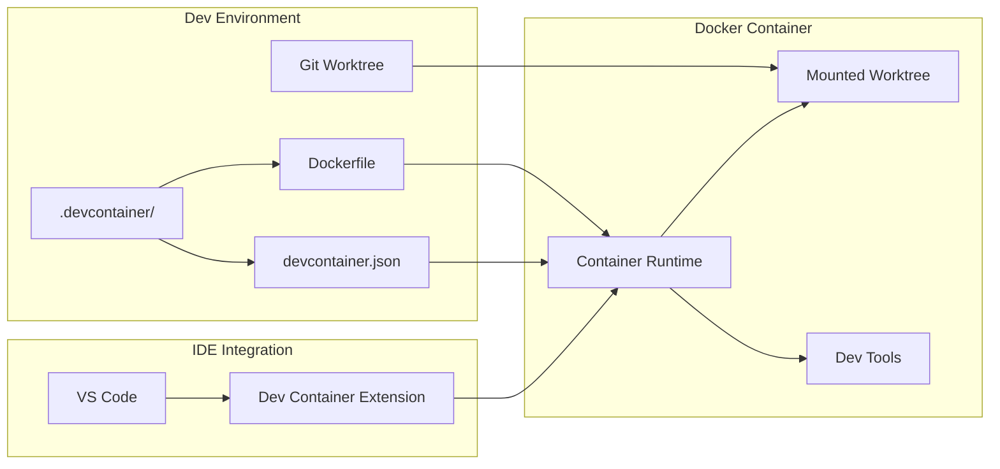

# MakeDev: Dev Environment CLI Solution Design

**Author:** System  
**Date:** 2025-07-08  
**Status:** Draft  
**Version:** 1.0  

## TL;DR

MakeDev is a Rust CLI application that creates and manages isolated development environments combining Git worktrees, branches, and dev containers. It provides an MCP server for AI agents and supports the dev container standard for IDE integration.

## Context and Scope

### Problem Statement

Developers often need to work on multiple features or bug fixes simultaneously, switching between different branches and configurations. Current solutions require manual management of:
- Git worktrees and branches
- Dev container setup and configuration
- Environment isolation and cleanup
- Integration with IDEs and AI coding agents

### Goals

- **Primary**: Provide a simple CLI to create, manage, and destroy isolated dev environments
- **Secondary**: Enable seamless integration with IDEs (VS Code) and AI agents (Claude Code)
- **Secondary**: Support the dev container standard for consistent development environments

### Non-Goals

- Production deployment automation
- Complex container orchestration beyond single dev containers
- IDE-specific integrations beyond dev container standard
- Multi-user environment management

### Success Metrics

- Time to create a new dev environment < 30 seconds
- Zero manual Git worktree/branch management
- Successful IDE connection to dev containers
- Functional MCP server for AI agent integration

## Solution Overview

### High-Level Architecture



### Core Components

1. **CLI Interface** (clap): User-facing command interface
2. **Environment Manager**: Core logic for environment lifecycle
3. **Git Integration** (libgit2): Worktree and branch management
4. **Docker Integration** (reqwest + Docker API): Container management
5. **MCP Server** (axum + SSE): AI agent communication
6. **State Management** (sqlx + SQLite): Persistent storage
7. **Dev Container Support**: Standard compliance and configuration

## Detailed Design

### Environment Data Model

```rust
#[derive(Debug, Clone)]
pub struct Environment {
    pub id: Uuid,
    pub name: String,
    pub worktree_path: PathBuf,
    pub branch_name: String,
    pub container_id: Option<String>,
    pub container_name: String,
    pub status: EnvironmentStatus,
    pub created_at: DateTime<Utc>,
    pub updated_at: DateTime<Utc>,
}

#[derive(Debug, Clone)]
pub enum EnvironmentStatus {
    Creating,
    Ready,
    Starting,
    Running,
    Stopped,
    Error(String),
}
```

### CLI Commands

```bash
# Environment management
makedev create <name> [--branch <branch>] [--from <base-branch>]
makedev list [--status <status>]
makedev start <name>
makedev stop <name>
makedev destroy <name>
makedev status <name>

# MCP server
makedev mcp-server [--port <port>] [--host <host>]

# Configuration
makedev config [--docker-socket <path>] [--worktree-root <path>]
```

### Environment Creation Flow



### MCP Server Integration



### Dev Container Integration



### Database Schema

```sql
CREATE TABLE environments (
    id TEXT PRIMARY KEY,
    name TEXT UNIQUE NOT NULL,
    worktree_path TEXT NOT NULL,
    branch_name TEXT NOT NULL,
    container_id TEXT,
    container_name TEXT NOT NULL,
    status TEXT NOT NULL,
    created_at TIMESTAMP DEFAULT CURRENT_TIMESTAMP,
    updated_at TIMESTAMP DEFAULT CURRENT_TIMESTAMP
);

CREATE INDEX idx_environments_name ON environments(name);
CREATE INDEX idx_environments_status ON environments(status);
```

### Error Handling Strategy

```rust
#[derive(Debug, thiserror::Error)]
pub enum MakeDevError {
    #[error("Environment '{0}' already exists")]
    EnvironmentExists(String),
    
    #[error("Environment '{0}' not found")]
    EnvironmentNotFound(String),
    
    #[error("Git operation failed: {0}")]
    GitError(#[from] git2::Error),
    
    #[error("Docker operation failed: {0}")]
    DockerError(String),
    
    #[error("Database operation failed: {0}")]
    DatabaseError(#[from] sqlx::Error),
    
    #[error("MCP server error: {0}")]
    McpError(String),
}
```

## Testing Strategy

### Unit Testing

```rust
// Git operations testing
#[cfg(test)]
mod tests {
    use super::*;
    use std::process::Command;
    
    #[test]
    fn test_create_worktree() {
        let env_manager = EnvironmentManager::new();
        let result = env_manager.create_worktree("test-env", "main");
        
        assert!(result.is_ok());
        
        // Verify with Git CLI
        let output = Command::new("git")
            .args(&["worktree", "list"])
            .output()
            .expect("Failed to execute git command");
        
        assert!(String::from_utf8_lossy(&output.stdout)
            .contains("test-env"));
    }
}
```

### Integration Testing

```rust
#[tokio::test]
async fn test_environment_lifecycle() {
    let app = TestApp::new().await;
    
    // Create environment
    let env = app.create_environment("test-env").await.unwrap();
    assert_eq!(env.status, EnvironmentStatus::Ready);
    
    // Verify Git worktree exists
    assert!(env.worktree_path.exists());
    
    // Verify Docker container
    let container = app.docker_client
        .inspect_container(&env.container_name)
        .await
        .unwrap();
    assert_eq!(container.state.status, "running");
    
    // Test MCP integration
    let mcp_response = app.mcp_client
        .execute_command(&env.name, "echo hello")
        .await
        .unwrap();
    assert_eq!(mcp_response.stdout, "hello\n");
    
    // Cleanup
    app.destroy_environment(&env.name).await.unwrap();
}
```

### Docker Integration Testing

```rust
#[tokio::test]
async fn test_docker_container_lifecycle() {
    let docker = DockerManager::new();
    
    // Test container creation
    let container_id = docker
        .create_dev_container("test-container", "/tmp/test-worktree")
        .await
        .unwrap();
    
    // Verify container via Docker CLI
    let output = Command::new("docker")
        .args(&["ps", "-f", &format!("id={}", container_id)])
        .output()
        .expect("Failed to execute docker command");
    
    assert!(String::from_utf8_lossy(&output.stdout)
        .contains("test-container"));
    
    // Test command execution
    let result = docker
        .execute_command(&container_id, "ls -la")
        .await
        .unwrap();
    
    assert!(result.exit_code == 0);
    
    // Cleanup
    docker.remove_container(&container_id).await.unwrap();
}
```

### MCP Server Testing

```rust
#[tokio::test]
async fn test_mcp_server() {
    let server = McpServer::new().await;
    let client = TestMcpClient::new();
    
    // Test SSE connection
    let stream = client.connect("http://localhost:8080/mcp").await.unwrap();
    
    // Test environment listing
    let environments = client.list_environments().await.unwrap();
    assert_eq!(environments.len(), 0);
    
    // Test file operations
    let env_name = "test-env";
    app.create_environment(env_name).await.unwrap();
    
    client.write_file(env_name, "/app/test.txt", "content").await.unwrap();
    let content = client.read_file(env_name, "/app/test.txt").await.unwrap();
    assert_eq!(content, "content");
}
```

### End-to-End Testing

```bash
#!/bin/bash
# E2E test script

set -e

echo "=== MakeDev E2E Tests ==="

# Test environment creation
echo "Testing environment creation..."
makedev create test-e2e --branch feature-test

# Verify Git worktree
if [ ! -d "$(pwd)/worktrees/test-e2e" ]; then
    echo "ERROR: Worktree not created"
    exit 1
fi

# Verify Git branch
cd worktrees/test-e2e
if [ "$(git branch --show-current)" != "feature-test" ]; then
    echo "ERROR: Branch not checked out"
    exit 1
fi
cd ../..

# Test container
echo "Testing container functionality..."
docker exec makedev-test-e2e ls -la | grep -q "src"

# Test MCP server
echo "Testing MCP server..."
curl -s "http://localhost:8080/mcp" | grep -q "environments"

# Test file operations via MCP
echo "Testing file operations..."
# TODO: Implement MCP client for testing

# Cleanup
echo "Cleaning up..."
makedev destroy test-e2e

echo "=== All tests passed ==="
```

### Performance Testing

```rust
#[tokio::test]
async fn test_environment_creation_performance() {
    let start = std::time::Instant::now();
    
    let env = EnvironmentManager::new()
        .create_environment("perf-test")
        .await
        .unwrap();
    
    let duration = start.elapsed();
    
    // Should create environment in less than 30 seconds
    assert!(duration < std::time::Duration::from_secs(30));
    
    // Cleanup
    EnvironmentManager::new()
        .destroy_environment("perf-test")
        .await
        .unwrap();
}
```

### Test Infrastructure

```rust
// Test utilities
pub struct TestApp {
    pub db: Database,
    pub docker_client: DockerClient,
    pub mcp_client: TestMcpClient,
    pub temp_dir: TempDir,
}

impl TestApp {
    pub async fn new() -> Self {
        let temp_dir = TempDir::new().unwrap();
        let db_path = temp_dir.path().join("test.db");
        let db = Database::new(&db_path).await.unwrap();
        
        Self {
            db,
            docker_client: DockerClient::new(),
            mcp_client: TestMcpClient::new(),
            temp_dir,
        }
    }
    
    pub async fn create_environment(&self, name: &str) -> Result<Environment> {
        // Test implementation
    }
}
```

## Implementation Plan

### Phase 1: Core Infrastructure (Weeks 1-2)
- Project setup with Cargo.toml dependencies
- CLI argument parsing with clap
- SQLite database schema and migrations
- Basic error handling and logging

### Phase 2: Git Integration (Week 3)
- libgit2 wrapper for worktree operations
- Branch creation and management
- Repository validation and initialization

### Phase 3: Docker Integration (Week 4)
- Docker API client with reqwest
- Container lifecycle management
- Volume mounting for worktrees
- Dev container configuration parsing

### Phase 4: MCP Server (Week 5)
- Axum web server setup
- SSE transport implementation
- MCP protocol handlers
- File system operations

### Phase 5: Testing & Polish (Week 6)
- Comprehensive test suite
- Documentation and examples
- Performance optimizations
- Error handling improvements

## Security Considerations

### Container Security
- Run containers with non-root user
- Limit container capabilities
- Use read-only mounts where possible
- Implement resource limits

### Git Security
- Validate repository URLs
- Sanitize branch names
- Prevent path traversal attacks
- Secure credential handling

### MCP Security
- Implement authentication for MCP server
- Validate all file operations
- Sandbox command execution
- Rate limiting for API endpoints

## Monitoring and Observability

### Metrics
- Environment creation/destruction times
- Container resource usage
- MCP server request rates
- Git operation success rates

### Logging
- Structured logging with tracing
- Environment lifecycle events
- Error tracking and reporting
- Performance monitoring

### Health Checks
- Database connectivity
- Docker daemon availability
- Git repository access
- MCP server responsiveness

## Deployment and Operations

### System Requirements
- Rust 1.70+
- Git 2.30+
- Docker 24.0+
- SQLite 3.38+

### Installation
```bash
# Via cargo
cargo install makedev

# Via release binary
wget https://github.com/user/makedev/releases/latest/makedev
chmod +x makedev
sudo mv makedev /usr/local/bin/
```

### Configuration
```yaml
# ~/.config/makedev/config.yaml
docker:
  socket: "/var/run/docker.sock"
  registry: "docker.io"
  
worktree:
  root: "~/dev/worktrees"
  cleanup_days: 30

mcp:
  port: 8080
  host: "127.0.0.1"
  
database:
  path: "~/.local/share/makedev/db.sqlite"
```

## Future Enhancements

### Short-term (3-6 months)
- Multi-repository support
- Custom dev container templates
- Environment templates and presets
- Resource usage monitoring

### Medium-term (6-12 months)
- Cloud provider integration
- Team collaboration features
- Environment sharing and snapshots
- Advanced IDE integrations

### Long-term (12+ months)
- Kubernetes backend support
- Multi-platform dev containers
- AI-powered environment optimization
- Enterprise features and management

## Conclusion

MakeDev provides a comprehensive solution for managing isolated development environments through a simple CLI interface. The architecture leverages proven technologies (Git, Docker, SQLite) while providing modern integrations (MCP, dev containers) for AI agents and IDEs.

The testing strategy ensures reliability through multiple validation layers, from unit tests to end-to-end scenarios. The phased implementation plan allows for incremental delivery and validation of core features.

This design balances simplicity for end users with extensibility for future enhancements, making it suitable for individual developers and potential team adoption.